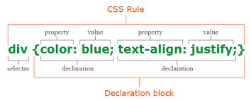
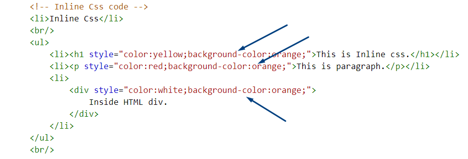
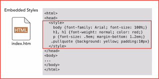
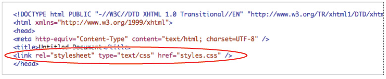

# Design web pages with CSS

- CSS give us the power to controlling on web pages and who to making it more attractive .
- Each Element has invisible box around it .
- CSS allows us to create rules that control the way that each individual box is presented.
- we can implement CSS on each element individualy ar as a group .

# Style Rules Of CSS

- CSS works by associating rules with HTML elements.

- CSS rules contain two parts:

    1. selector 

    2. decelaration

- inside decelaration ther is to parts:

    1. property

    2. value

# CCS Using
- we can use css in three way:
    1. inline
    2. embedded
    3. external

### Inline 
- we can write CSS inside html tage by write the word *Style*

### Embedded 
- we can use CSS inside head tage by write the *Style tag*

### External 
- we can use CSS as external file and link it in html by write *Link tag inside head tag*

# Color Rules Of CSS

- Color can bring your page to life and make it more attractive.

#### where i can use color with css

- we can use color in :

    1. we can use it as *Foreground Color*:

        - the property we use is *color* it take three values:

        1. RGB color

        2. HEX color

        3. Color name

    2.  we can use it as *Background Color*:

        - the property we use is *background-color* it take three values:

         1. RGB color

        2. HEX color

        3. Color name

    
