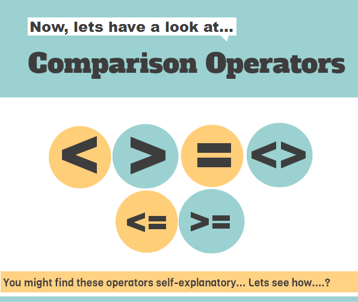
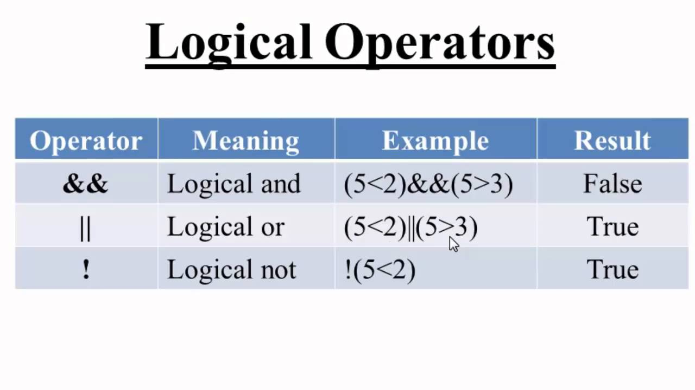

# Comparison and logical operators

## Comparison 




- JavaScript supports Many comparison operators.
- let's take example Assume variable A holds 10 and variable B holds 20 then we will take all operaters 

**Operater** | **Descriptions** |**Example**
------------ | -----------------|-----------------
== (Equal)| Checks if the value of two operands are equal or not, if yes, then the condition becomes true.|Ex: (A == B) is not true.
!= (Not Equal)| Checks if the value of two operands are equal or not, if the values are not equal, then the condition becomes true.|Ex: (A != B) is true.
_>_ (Greater than)| Checks if the value of the left operand is greater than the value of the right operand, if yes, then the condition becomes true.|Ex: (A > B) is not true..
_<_ (Less than)| Checks if the value of the left operand is less than the value of the right operand, if yes, then the condition becomes true.|Ex: (A < B) is true.
_>=_ (Greater than or Equal to)| Checks if the value of the left operand is greater than or equal to the value of the right operand, if yes, then the condition becomes true.|Ex: (A >= B) is not true.
_<=_ (Less than or Equal to)|Checks if the value of the left operand is less than or equal to the value of the right operand, if yes, then the condition becomes true.|Ex: (A <= B) is true.


# logical operators



- JavaScript supports have main three logical operators 
- let's take example Assume variable A holds 10 and variable B holds 20 then we will take all operaters 


**Operater** | **Descriptions** |**Example**
------------ | -----------------|-----------------
&& (Logical AND)|If both the operands are non-zero, then the condition becomes true.|Ex: (A && B) is true.
(Logical OR)|If any of the two operands are non-zero, then the condition becomes true.|Ex: (A or B) is true.
! (Logical NOT)|Reverses the logical state of its operand. If a condition is true, then the Logical NOT operator will make it false|Ex: ! (A && B) is false.


# Loops

### for Loop
- The 'for' loop is the most compact form of looping. It includes the following three important parts −

    1. The loop initialization where we initialize our counter to a starting value. The initialization statement is executed before the loop begins.
    2. The test statement which will test if a given condition is true or not. If the condition is true, then the code given inside the loop will be executed, otherwise the control will come out of the loop.

    3. The iteration statement where you can increase or decrease your counter.

- You can put all the three parts in a single line separated by semicolons.


#### The syntax of for loop is JavaScript is as follows 
```
for (initialization; test condition; iteration statement) {
   Statement(s) to be executed if test condition is true
}
```

### while Loop
 - The most basic loop in JavaScript is the while loop which would be discussed in this chapter. The purpose of a while loop is to execute a statement or code block repeatedly as long as an expression is true. Once the expression becomes false, the loop terminates.


 ### The syntax of while loop in JavaScript is as follows 
```
while (expression) {
   Statement(s) to be executed if expression is true
}
```


