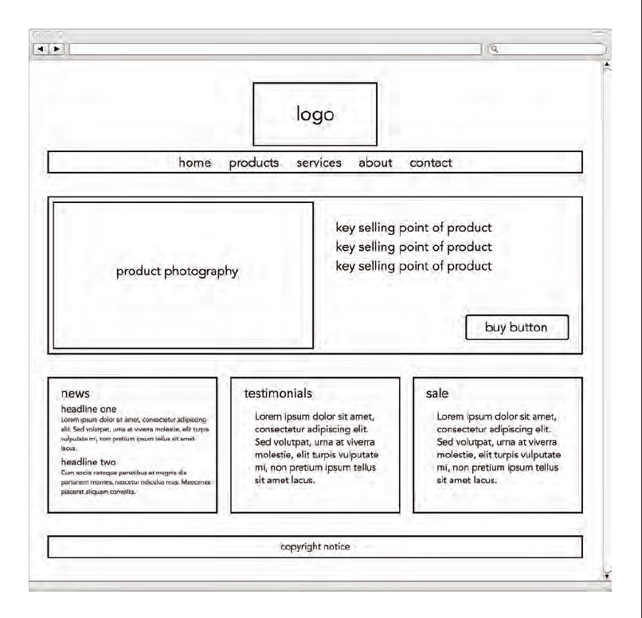
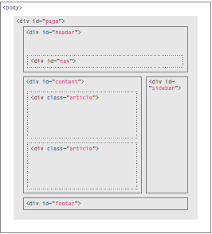

# Design-Structure Summary

## Chapter 18
1. It describe how to build the website and mentioned the criteria that we should follow to design the web site

2. It give us some questions should we ask to understand the audience's needs?

2. 0. there is two type of audience 
   - individuals
   - Companies
   - and this some of question:
   
      1. Who is the site For ?
      Every website should be designed for the target audience and not just for yourself or the site owner.You should know if your vistitors are individuals or companies and if they are individuals you should know thier age and the area they live in .. etc.

      2. Why PeoPle visit your Website ?
      Here you should search for your vistors Key motivations and specific goals.

      3. What your visitors are trying to achieve ?
      You should create a list of reasons why people would be coming to your site. 

      4. What information your visitors need ?
      Now you need to work out what information they need in order to achieve their goals quickly and effectively.

      5. How often people will visit your site ?
      Working out how often people are likely to revisit your site gives you an indication for how often you should update the site.


      
3. it determain why poeple will visit the website we will design and 
the reason for that.

4. It Describe to us what is the information type that we must provide for our visiters.

5. It explain how will by site map and how many section will be in our website


6. there is also Wireframe it is simply sketch to explain what is the information in each page



7. In this Chapter also show us how to organizing content in each page to make users understand what is important and what is not.

8. finally it give us some tips on Grouping and similarity and how we can design navigation bar 


## Chapter 17

1. It show us the traditional Layout and what is the div tag and what used to divide the page with div by indicate the role of it 



2. what is the new HTML5 layout element is and how they help to divide the page easly

3. after first two step it start to explain each element in HTML5 


## some html Tags

**Name** | **Html Tag**

------------ | -------------
<<<<<<< HEAD
Headers  |    <header> 
Footers |    <footer>
Navigation | <nav>
Articles|   <article>
Asides  |    <aside>  
Sections| <section>
Heading Groups |<hgroup>
Figures|   <figure> <figcaption>
Sectioning El ements|<div>
||||||| 6736e3f
   Headers |    <header> 
   Footers |    <footer>
   Navigation | <nav>
   Articles|   <article>
   Asides  |    <aside>  
   Sections| <section>
   Heading Groups |<hgroup>
    Figures|   <figure> <figcaption>
    Sectioning El ements|<div>
=======
Headers  |   ```<header>```
Footers |    ```<footer>```
Navigation | ```<nav>```
Articles|   ```<article>```
Asides  |    ```<aside>```  
Sections| ```<section>```
Heading Groups |```<hgroup>```
Figures|   ```<figure> <figcaption>```
Sectioning El ements|```<div>```

>>>>>>> e3d390e1d27e43b96591d11099184f329e7c6b7a
