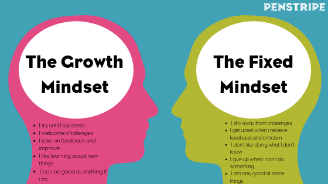

# Growth mindset
## What is Growth midset ?
There are many factors that determine the extent of human intelligence, such as heredity and the environment in which he lives
thats for sure but this factors determin just the start poin of human life. But what he does next is what lies in either developing his intelligence or staying the same. The concept of **Growth mindset** is believing that anyone can develop his abilities with efforts and seeking success.

On the contrary, there are those who find that they do not need this effort and can achieve success only with their genes and those they have fixed mindset.

Take a look on the illustartion to see the differences between a fixed and a growth mindset:

## How I can maintaining a growth mindset ?

1. **Challenges**:
Having a growth mindset means relishing opportunities for self-improvement.

2. **Obstacles**:
There’s no one-size-fits-all model for learning. What works for one person may not work for you.

3. **Effort**:
Intelligent people enjoy the learning process, and don’t mind when it continues beyond an expected time frame.

## My growth mindest statment 

**Instead of** | **I can say**
------------ | -------------
I am not good at this | I am not good at this yet. But I will learn.
This is too hard | This will require effort and finding the right strategy.
I can not do this | I need some feedback and help from others

## what make me to take this standered is :
1. there some poeple know somthing i do not know 
2. to be good programmer i should keep learn new thing 
3. the technolege field update rapidly 
