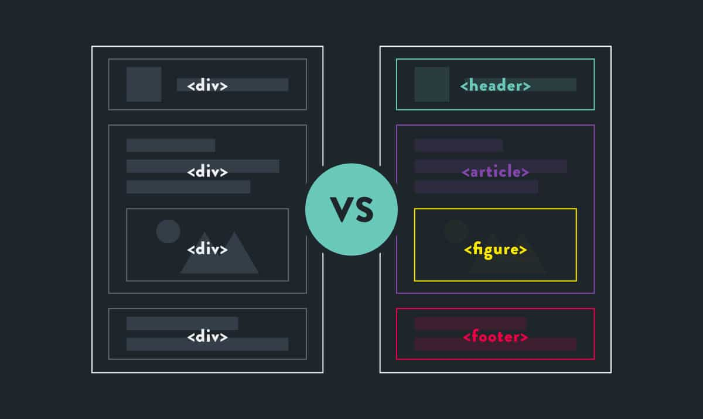

# Class 02 Reading

## Html 
### Chapter 2 Text : 

- In this chapter we focus on how to add markup to the text that
    appears on your pages. You will learn about :
    1. Structural markup : the elements that you can use to
    describe both headings and paragraphs
    2. Semantic markup : which provides extra information; such
    as where emphasis is placed in a sentence, that something
    you have written is a quotation (and who said it), the
    meaning of acronyms, and so on

    

# Structural markup 
## 1. Headings
- HTML has six "levels" of headings:
    - `<h1>`
    - `<h2>`
    - `<h3>`
    - `<h4>`
    - `<h5>`
    - `<h6>`
- Browsers display the contents of headings at different sizes.
    - contents of an `<h1>` element is
        the largest, and the contents of
        an `<h6>` element is the smallest.
    - `<h1>` is used for main headings
    - `<h2>` is used for subheadings
    - and so on.

## 2. Paragraphs
    - To create a paragraph, surround
        the words that make up the
        paragraph with an opening `
`
        tag and closing `
` tag.

## 3. Bold & Italic
## Bold
- ### `<b>`
    - By enclosing words in the tags
        `<b>` and `</b>` we can make
        characters appear bold.

## Italic
- ### `<i>`
    - By enclosing words in the tags
        `<i>` and `</i>` we can make
        characters appear italic.

## 4. Superscript & Subscript
- ### ``
    - The `` element is used
    to contain characters that
    should be superscript such
    as the suffixes of dates or
    mathematical concepts like
    raising a number to a power such
    as 22.
- ### ``
    - The `` element is used to
    contain characters that should
    be subscript. It is commonly
    used with foot notes or chemical
    formulas such as H20.

## 5. Line Breaks & Horizontal Rules
- ### ` `
    - As you have already seen, the
    browser will automatically show
    each new paragraph or heading
    on a new line. But if you wanted
    to add a line break inside the
    middle of a paragraph you can
    use the line break tag ` `.

- ### `
`
    - To create a break between
    themes — such as a change of
    topic in a book or a new scene
    in a play — you can add a
    horizontal rule between sections
    using the `
` tag.

# Semantic Markup
- There are some text elements that are not intended to affect the
    structure of your web pages, but they do add extra information to the
    pages — they are known as semantic markup.
## 1. Strong & Emphasis
- ### `<strong>`
    - The use of the `<strong>`
        element indicates that its
        content has strong importance.
        For example, the words
        contained in this element might
        be said with strong emphasis.
        By default, browsers will show
        the contents of a `<strong>`
        element in bold.

- ### `<em>`
    - The `<em>` element indicates
    emphasis that subtly changes
    the meaning of a sentence.
    By default browsers will show
    the contents of an `<em>` element
    in italic.

## 2. Quotations
-  There are two elements commonly used for marking up quotations:
- ### 1. `<blockquote>`
   - The `<blockquote>` element is
    used for longer quotes that take
    up an entire paragraph. Note
    how the `
` element is still
    used inside the `<blockquote>`
    element.
- ### 2. `<q>`
    - The `<q>` element is used for
    shorter quotes that sit within
    a paragraph. Browsers are
    supposed to put quotes around
    the `<q>` element, however
    Internet Explorer does not —
    therefore many people avoid using the `<q>` element.

# Summary
1. HTML elements are used t XX o describe the structure of
the page (e.g. headings, subheadings, paragraphs).
2. They also provide semantic information (e.g. where
emphasis should be placed, the definition of any
acronyms used, when given text is a quotation).

# Chapter 10 Introducing CSS

- In this section, we will look at how to
    make your web pages more attractive,
    controlling the design of them using CSS.

- the big secret in css is  to
    imagine that there is an invisible box around
    every HTML element.

- we can Associates css with html elements by some rules
- and CSS rules contain two parts:
    1. selector
    2. declaration.

### Selectors
- Selectors indicate which
    element the rule applies to.
    The same rule can apply to
    more than one element if you
    separate the element names
    with commas.

### Declarations
- Declarations indicate how
the elements referred to in
the selector should be styled.
Declarations are split into two
parts (a property and a value),
and are separated by a colon.

- the Declarations part has two value: 
    1. property
    2. value

### Properties
- Properties indicate the aspects
of the element you want to
change. For example, color, font,
width, height and border.

### Values
- Values specify the settings
you want to use for the chosen
properties. For example, if you
want to specify a color property
then the value is the color you
want the text in these elements
to be.

## how to use CSS?
- we can use css in three way:
    1. inline
    2. extrenal
    3. embeded 

- the best way is external way and the resone it the best way is: 
    1. All of your web pages can share
        the same style sheet.
    2. Therefore, once the user has
        downloaded the CSS stylesheet,
        the rest of the site will load
        faster.

## JavaScript
## Chpter 2 Basic JavaScript Instructions
### Definition
- A script is a series of instructions that a computer can follow one-by-one.
Each individual instruction or step is known as a statement.
Statements should end with a semicolon.

**STATEMENTS ARE INSTRUCTIONS AND EACH ONE STARTS ON A NEW LINE:**
- A statement is an individual instruction that the
computer should follow.

**STATEMENTS CAN BE ORGANIZED INTO CODE BLOCKS:**
- Some statements are surrounded by curly braces;
these are known as code blocks. The closing curly
brace is not followed by a semicolon.

### Comment in JavaScript
- You should write comments to explain what your code does.
They help make your code easier to read and understand.
This can help you and others who read your code.
- there are two type of commit 
    1. single line commit
        - `// Create a ne1~ dat e object`
    2. multiple line commit 
        - `/* Th i s script displays a greeting to the user based upon the current time.
        It is an example from JavaScript & jQuery book */`

### WHAT IS A VARIABLE?
- A script will have to temporarily
store the bits of information it
needs to do its job. It can store this
data in variables.

### Who to declare variable ?
- to declare variable we use key ward var "name of variable"
   - * example : var name ;
- we can use the same variable without var to assign value
    - * example :  name = "your name" ;

### JavaScript Data Type
1. Numbers, eg. 123, 120.50 etc.

2. Strings of text e.g. "This text string" etc.

3. Boolean e.g. true or false.

4. Arrays e.g. colors = ['white', 'black', ' custom '];

### Arrays 
#### def :
- An array is a special type of variable. It doesn't
just store one value; it stores a list of values.

#### CREATING AN ARRAY
- there is two way to defiend arrays: 
- var colors;
    colors =  ['white', 'black', ' custom '];
- var colors = new Array('white ' ,'black','custom ' );

### EXPRESSIONS
- An expression evaluates into (results in) a single value. Broadly speaking
there are two types of expressions.
- there is two type of Expressions :
    1. EXPRESSIONS THAT JUST ASSIGN A
        VALUE TO A VARIABLE
        - e.g. var color = 'beige';
    2. EXPRESSIONS THAT USE TWO OR
        MORE VALUES TO RETURN A
        SINGLE VALUE
        - e.g. var area = 3 * 2;
    
###  operators.
1. Assignment operators
    - An assignment operator assigns a value to its left operand based on the value of its right operand. The simple assignment operator   is equal (=), which assigns the value of its right operand to its left operand. That is, x = y assigns the value of y to x.
2. Comparison operators
    - A comparison operator compares its operands and returns a logical value based on whether the comparison is true. The operands can be numerical, string, logical, or object values.
3. Arithmetic operators
    - An arithmetic operator takes numerical values (either literals or variables) as their operands and returns a single numerical value. The standard arithmetic operators are addition (+), subtraction (-), multiplication (*), and division (/). 
4. Logical operators
    - Logical operators are typically used with Boolean (logical) values; when they are, they return a Boolean value. However, the && and || operators actually return the value of one of the specified operands, so if these operators are used with non-Boolean values, they may return a non-Boolean value
5. String operators
    - In addition to the comparison operators, which can be used on string values, the concatenation operator (+) concatenates two string values together, returning another string that is the union of the two operand strings.
6. Conditional (ternary) operator
    - The conditional operator is the only JavaScript operator that takes three operands. The operator can have one of two values based on a condition 
    - Example :var status = (age >= 18) ? 'adult' : 'minor';
7. Comma operator
    - The comma operator (,) simply evaluates both of its operands and returns the value of the last operand. This operator is primarily used inside a for loop, to allow multiple variables to be updated each time through the loop. It is regarded bad style to use it elsewhere, when it is not necessary. Often two separate statements can and should be used instead.
8. Relational operators
    - A relational operator compares its operands and returns a Boolean value based on whether the comparison is true.

## Chapter 4 Decisions and Loops

- Decisions
    - If statements - If a condition is true, then run the code in that block.
    - If...Else statements - If a condition is true, then run the code in that block. Otherwise, run the code in the else block.
- Loops
    - For loops - Run the code in this block based on a set number of iteration. This is known.
    - While loops - Run the code in this block while a condition is true. The number of iterations is unknown.

