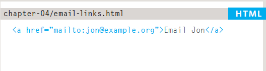

# Class 04 Reading

# HTML

## Chapter 4 Links
#### Definition
- a link is a selectable connection from one word, picture, or information object to another.
- we use link in html to connect pages,web sites and external resource like css  and javascript files.

- commonly link use:
    1. Links from one website to another
    2. Links from one page to another on the same website
    3. Links from one part of a web page to another part of the
        same page
    4. Links that open in a new browser window
    5. Links that start up your email program and address a new
    email to someone

- # how we can defined links?
- we can defiend link in two way:
 1. By use the `<a>` tage
    - Links are created using the `<a>` element. Users can click on anything
    between the opening `<a>` tag and the closing `</a>` tag. You specify
    which page you want to link to using the href attribute.
    - in `<a>` tage there is an attribute called href we use it to put the web site or page that we want to link it.

        
    
    - we can use `<a>` tag to linke emails by use the key word mailto inside href and before the email name.

        

    - we can use `<a>` tag to linke content in the same page
    to by like diraction by use the # inside href 
        

2. by use the `<link>` tage
    - we use it for link external file like css file.
        

# Sammury
1. Links are created using the `<a>` element.
2. The `<a>` element uses the href attribute to indicate
the page you are linking to.
3. If you are linking to a page within your own site, it is
best to use relative links rather than qualified URLs.
4. You can create links to open email programs with an
email address in the "to" field.
5. You can use the id attribute to target elements within
a page that can be linked to.

# CSS
# Chapter 15 Layout

- we are going to look at
    how to control where each element sits
    on a page and how to create attractive
    page layouts.
- we will learn :
    1. Controlling the position of elements
    2. Creating site layouts
    3. Designing for different sized screens

## Key Concepts in Positioning Elements
- ### Building Blocks
    - CSS treats each HTML element as if it is in its
    own box. This box will either be a block-level
    box or an inline box.
    - we have two type of block : 
     1. Block-level elements start on a new line Examples include:
        
        `<h1> 
 <ul> <li>` 
    2. Inline elements flow in between surrounding text Examples  include:
        ` <b> <i>`

- ### Controll ing the Position of Elements
    1. Normal flow Every block-level element appears on a new line
        - position:static
    2. Relative Positioning This moves an element from the position it would be in normal flow
        - position:relative
    3. Absolute positioning This positions the element in relation to its containing element. It is taken out of normal flow.
        - position:absolute
    4. Fixed Positioning This is a form of absolute positioning that positions the element in relation to the browser window
        - position:fixed
    5. Floating Elements Floating an element allows you to take that element out of normal flow and position it to the far left or right of a containing box. The floated element becomes a block-level element around which other content can flow.
        - float (right, left)

# JavaScript 
## Chapter 3 Functions, Methods, and Objects
### why use it ?
- Programmers use
        functions, methods, and objects to organize their code.

#### Functions & METHODS
- Functions consist of a series of statements that have been grouped together because they perform a specific task. A method is the same as function, except methods are created inside (and are part of) an object

- create function:

    
- call function:

    
- create function that take paramerters:

    

#### Objects
- In Chapter 1 you saw programmers use objects to create models of the world using data, and that objects are made up of properties and methods In this section, you learn how to create your own objects using JavaScript
            
#### BUILT-IN OBJECTS
- The browser comes with set of objects that act like a toolkit for creating interactive web pages. This section introduces you to a number of built-in you learn objects, which you will then see used throughout the rest of the book.

# 6 Reasons for Pair Programming
- two person help each other to write code on write the code and the other give het tips and thoughts.
## Advantage
1. Greater efficiency
2. Engaged collaboration
3. Learning from fellow students
4. Social skills
5. Job interview readiness
6. Work environment readiness