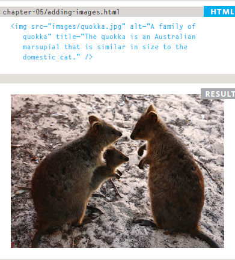
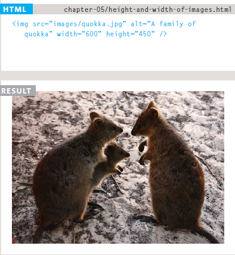
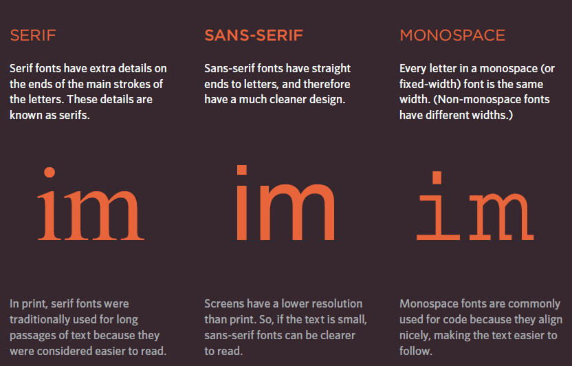

# Class 05 Reading

# HTML
## Chapter 5 Images : 
- there is many resone to add image to web page:
    1. Add image as logo.
    2. add image as favicon.
    3. add image as diagram
    4. add image as chart.
    5. add image as link 
    6. add image to explain some text.

- we put images in our site to make it look more attractive and professional.

- there is multiple format for image to add in html page:
    1. png image.
    2. jpg image.
    3. icons image.
    4. jpeg image.
    5. gif image.
    6. online image.
    7. etc....

## Choosing Images for Your Site
- A picture can say a thousand words, and great
images help make the difference between an
average-looking site and a really engaging one.
- Images should...
    - Be relevant
    - Convey information
    - Convey the right mood
    - Be instantly recognisable
    - Fit the color palette

## Storing Images on Your Site
- If you are building a site from scratch, it is good
practice to create a folder for all of the images
the site uses.

## Adding Images
- ta add image in html we should write the tag ``
- the `` take some attribute :
    1. ### src :
        - This tells the browser where
            it can find the image file.
        - the URL we will put in it will pointing where the image exist.
    2. ### alt :
        - This provides a text description
        of the image which describes the
        image if you cannot see it.
    3. ### title
        - You can also use the title
        attribute with the `` element
        to provide additional information
        about the image.

        

    4. ### height
        - This specifies the height of the
        image in pixels.
    5. ### width
        - This specifies the width of the
        image in pixels.

        

## Where to Place Images in Your Code
- ### we can put image in: 
 1. #### before a paragraph: 
    - The paragraph starts on a new
      line after the image.
 2. #### inside the start of a paragraph
    - The first row of text aligns with
    the bottom of the image.

 3. #### in the middle of a paragraph
    - The image is placed between the
    words of the paragraph that it
    appears in.

## Aligning Images Horizontally
- we can align Image Horizontally be use align attribute in `` tag and it take two value:
    - **left** :
        This aligns the image to the left
        (allowing text to flow around its
        right-hand side).
    - **right** :
        This aligns the image to the right
        (allowing text to flow around its
        left-hand side).

## Aligning Images Vertically
- we can align Image Vertically be use align attribute in `` tag and it take three value:
    - **top**:
        This aligns the first line of the
        surrounding text with the top of
        the image.
    - **middle** :
        This aligns the first line of the
        surrounding text with the middle
        of the image.
    - **bottom** :
        This aligns the first line of the
        surrounding text with the bottom
        of the image.

# CSS
## Chapter 11 Color :
- Color can really bring your pages to life.

### Foreground Color
 - **color** : it take three value :
    1. rgb values :
        These express colors in terms
        of how much red, green and
        blue are used to make it up. For
        example: rgb(100,100,90)
    2. hex codes :
        These are six-digit codes that
        represent the amount of red,
        green and blue in a color,
        preceded by a pound or hash #
        sign. For example: #ee3e80
    3. color names :
        There are 147 predefined color
        names that are recognized
        by browsers. For example:
        DarkCyan

### Background Color
- **background-color** :
CSS treats each HTML element
as if it appears in a box, and the
background-color property
sets the color of the background
for that box.

### Contrast
- When picking foreground and background
colors, it is important to ensure that there is
enough contrast for the text to be legible.

# Chapter 12 Text :
## Typeface Terminology

## Text Transformation
- The text-transform property is used to specify uppercase and lowercase letters in a text.

- It can be used to turn everything into uppercase or lowercase letters, or capitalize the first letter of each word.

## Text Decoration
- The text-decoration property is used to set or remove decorations from text.

- The value text-decoration: none; is often used to remove underlines from links.

## Text Indentation
- The text-indent property is used to specify the indentation of the first line of a text.

## Text Shadow
- The text-shadow property adds shadow to text.

- In its simplest use, you only specify the horizontal shadow (2px) and the vertical shadow (2px)

## Text Alignment
- The text-align property is used to set the horizontal alignment of a text.

- A text can be left or right aligned, centered, or justified.

- The following example shows center aligned, and left and right aligned text (left alignment is default if text direction is left-to-right, and right alignment is default if text direction is right-to-left)

