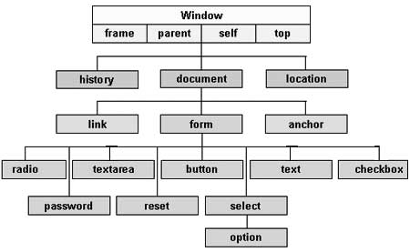
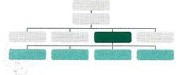

# Class 06 Reading

# JavaScript
## Chapter 3 Object Literals : 

### Calling Function That need Information
- there is two type of function we can use:
    1. Function without parameters.
    2. Function with parameters.

## Function with parameters
- Definition :
    - function functionName(parameters) {
        alert(parameters);
        }
- when we need to call function with parameters we should pass it's parameters 
    - the parameters can by as value.
        - functionName(argument);
    - the parameters can by as variable.
        - var name = 'username';
        - functionName(name);

## Return value from Function
- we can return one value from function using return keyword.
    - example:

        

- we can return multiply value from function.
    - example:

        

## ANONYMOUS FUNCTIONS & FUNCTION EXPRESSIONS
- **FUNCTION EXPRESSION**
    If you put a function where the interpreter would
    expect to see an expression, then it is treated as an
    expression
- **anonymous function** the function is stored in a variable
        It can be called like any function created
        with a function declaration.

# Chapter 5 Document Object Model

## Introduction

- Every web page resides inside a browser window which can be considered as an object.

- A Document object represents the HTML document that is displayed in that window. The Document object has various properties that refer to other objects which allow access to and modification of document content.

- The way a document content is accessed and modified is called the **Document Object Model**, or **DOM**. The Objects are organized in a hierarchy. This hierarchical structure applies to the organization of objects in a Web document.

1. Window object − Top of the hierarchy. It is the outmost element of the object hierarchy.

2. Document object − Each HTML document that gets loaded into a window becomes a document object. The document contains the contents of the page.

3. Form object − Everything enclosed in the `<form>...</form> `tags sets the form object.

4. Form control elements − The form object contains all the elements defined for that object such as text fields, buttons, radio buttons, and checkbo

- Here is a simple hierarchy of a few important objects 
    

**The DOM is neither part of HTML, nor part of JavaScript; it is a separate set of rules. It is implemented by all major browser makers, and covers two primary areas:**

1. MAKING A MODEL OF THE HTML PAGE
2. ACCESSING AND CHANGING THE HTML PAGE

## THE DOM TREE IS A MODEL OF A WEB PAGE
- As a browser loads a web page, it creates a model of that page.
The model is called a DOM tree, and it is stored in the browsers' memory.
- BODY OF HTML PAGE

- there are four types of nodes
    1. THE DOCUMENT NODE
        - Every element, attribute, and piece of text in the HTML is represented by its own DOM node.
    2. ELEMENT NODES
        - HTML elements describe the structure of an HTML page. (The `<h1 > - <h6>` elements describe what parts are headings; the `
` tags indicate where paragraphs of text start and finish; and so on.)
    3. ATTRIBUTE NODES
        - The opening tags of HTML elements can carry attributes and these are represented by attribute nodes in the DOM tree.
    4. TEXT NODES
        - Once you have accessed an element node, youcan then reach the text within that element. This is stored in its own text node.

 

 ## WORKING WITH THE DOM TREE
 - Accessing and updating the DOM tree involves two steps:
    1. Locate the node that represents the element you want to work with.
    2. Use its text content, child elements, and attributes.

    #### STEP 1: ACCESS THE ELEMENTS
    1. SELECT AN INDIVIDUAL ELEMENT NODE
        - Here are three common ways to select an individual element:
            1. get ElementByld()
            2. querySelector()

         
    2. SELECT MULTIPLE ELEMENTS (NODELISTS)
        - There are three common ways to select multiple elements.
            1. getElementsByClassName()
            2. getElementsByTagName()
            3. querySelectorAll()
            
         
    3. TRAVERSING BETWEEN ELEMENT NODES
        - You can move from one element node to a related element node.
            1. parentNode
            2. previousSibling / nextSibling
            3. firstChild / lastChild
            
         
    
    #### STEP 2: WORK WITH THOSE ELEMENTS
    1. ACCESS/ UPDATE TEXT NODES
        
         
    2. WORK WITH HTML CONTENT
            
         
    3. ACCESS OR UPDATE ATTRIBUTE VALUES
            
         

## Caching Dom Queries
- Methods that find element in the DOM tree is called DOM queries.
- we can store the query result in variable.

    

## ACCESSING ELEMENTS
- DOM queries may return one element, or they may return a Nodelist, which is a collection of nodes.
#### METHODS THAT RETURN A SINGLE ELEMENT NODE:
1. getElementByld('id')

    

2. querySelector('css selector')

    

3. getElementsByClassName('class')

    

4. getElementsByTagName('tagName')

    

5. querySelectorAll ('css selector')

    

## SELECTING ELEMENTS USING ID ATTRIBUTES
- get El ementByid () al lows you
to select a single element node
by specifying the value of its
id attribute.

### NODELISTS: DOM QUERIES THAT RETURN MORE THAN ONE ELEMENT
- When a DOM method can return more than one element, it returns a
Nodelist (even if it only finds one matching element).

- we have four different DOM queries that all return a Nodelist.
    1. getElementsByTagName('hl')
    2. getElementsByTagName('li')
    3. getElementsByClassName('hot')
    4. querySelectorAll ('li [id]')

## Repeting Action for An Entire NodeList
- we can loop throught each node 

     

## TRAVERSING THE DOM
- When you have an element node, you can select
another element in relation to it using these five
properties. This is known as traversing the DOM.
1. parentNode
2. previousSibling
3. nextSibling
4. firstChild
5. lastChild
       

        

