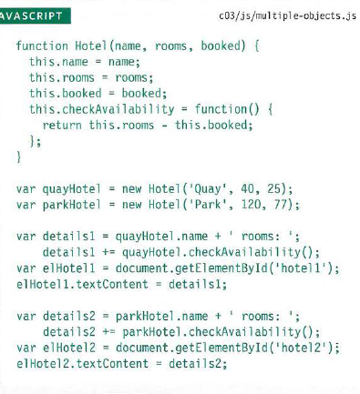

# Class 07 Reading

# HTML
## Chapter 6: Tables
### What's a Table?
- A table represents information in a grid format.
Examples of tables include financial reports, TV
schedules, and sports results.

### Basic Table St ructure
-  `<table> `
The  `<table> ` element is used
to create a table. The contents
of the table are written out row
by row.
-  `<tr> `
You indicate the start of each
row using the opening  `<tr> ` tag.
(The tr stands for table row.)
It is followed by one or more
 `<td> ` elements (one for each cell
in that row).
At the end of the row you use a
closing  `</tr> ` tag.
-  `<td> `
Each cell of a table is
represented using a  `<td> `
element. (The td stands for
table data.)

### Table Headings
- `<th>`
The `<th>` element is used just
like the `<td> `element but its
purpose is to represent the
heading for either a column or
a row. (The th stands for table
heading.)

### Spanning ColumnS
- Sometimes you may need the
entries in a table to stretch
across more than one column.
- The colspan attribute can be
used on a `<th>` or `<td>` element
and indicates how many columns
that cell should run across.

### Spanning Rows
- You may also need entries in
a table to stretch down across
more than one row.
- The rowspan attribute can be
used on a `<th>` or `<td>` element
to indicate how many rows a cell
should span down the table.

### Long Tables
- There are three elements that
help distinguish between the
main content of the table and
the first and last rows (which can
contain different content).

1. `<thead>`
The headings of the table should
sit inside the `<thead>` element.
2. `<tbody>`
The body should sit inside the
`<tbody>` element.

3. `<tfoot>`
The footer belongs inside the
`<tfoot>` element.

## Summary
- The `<table>` element is used to add tables to a web
page.
- A table is drawn out row by row. Each row is created
with the `<tr>` element.
- Inside each row there are a number of cells
represented by the `<td>` element (or `<th>` if it is a
header).
- You can make cells of a table span more than one row
or column using the rowspan and colspan attributes.
- For long tables you can split the table into a `<thead>`,
`<tbody>`, and `<tfoot>`.

# JavaScript
### HOW MEMORY & VARIABLES WORK
- Global variables use more memory. The browser has to remember them
for as long as the web page using them is loaded. Local variables are only
remembered during the period of time that a function is being executed.

### WHAT IS AN OBJECT?
- Objects group together a set of variables and functions to create a model
of a something you would recognize from the real world. In an object,
variables and functions take on new names.

### CREATING· OBJECTS USING LITERAL NOTATION

### CREATING MORE OBJECT LITERALS

### CREATING OBJECTS USING CONSTRUCTOR SYNTAX

### CREATE & ACCESS OBJECTS CONSTRUCTOR NOTATION

### ADDING AND REMOVING PROPERTIES

### THIS (IT IS A KEYWORD)
- The keyword this is commonly used inside functions and objects.
Where the function is declared alters what this means. It always refers
to one object, usually the object in which the function operates.

### RECAP: STORING DATA
- In JavaScript, data is represented using name/value pairs.
To organize your data, you can use an array or object to group a set of
related values. In arrays and objects the name is also known as a key.

### THE DOCUMENT OBJECT MODEL: THE DOCUMENT OBJECT
- The topmost object in the Document Object Model (or DOM) is the
document object. It represents the web page loaded into the current
browser window or tab.

### GLOBAL OBJECTS: STRING OBJECT
- Whenever you have a value that is a string, you can use the properties
and methods of the String object on that valu e. This example stores the
phrase "Home sweet home " in a variable.
- var saying = 'Home sweet home'

### DATA TYPES REVISITED
1. String
2. Number
3. Boolean
4. Undefined (a variable that has been declared, but
no value has been assigned to it yet)
5. Null (a variable with no value - it may have had
one at some point, but no longer has a value)
6. 0bject Under the hood, arrays and functions are considered
types of objects.