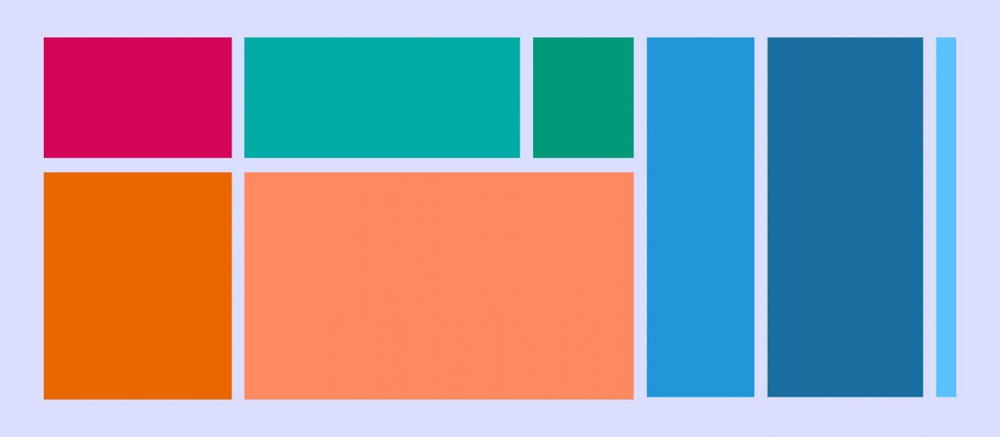
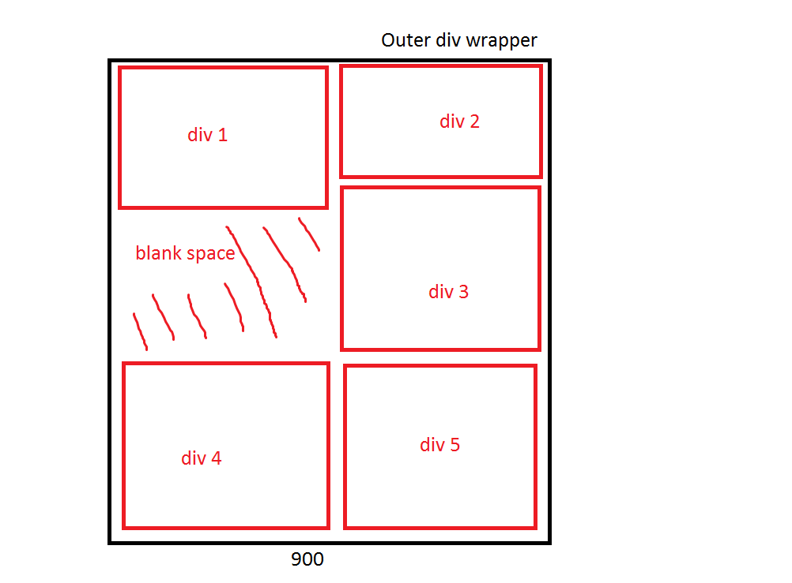
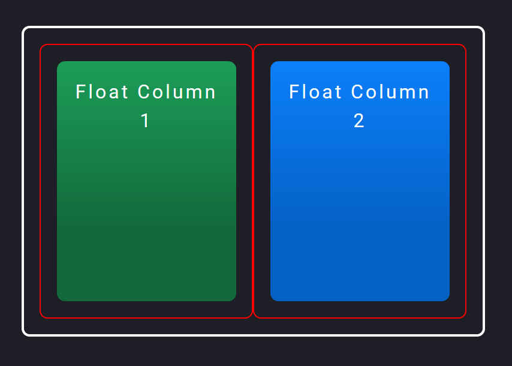
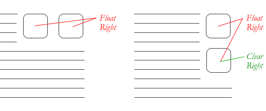
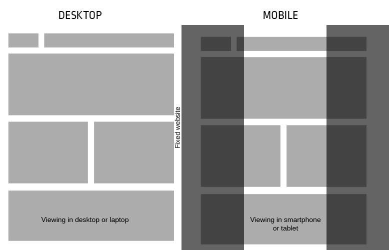
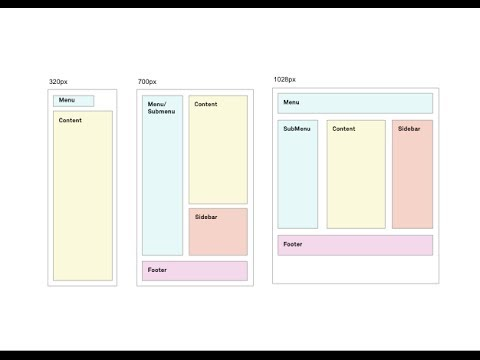

# Class 08 Reading

# CSS
# Chapter 15 Layout

- we are going to look at
    how to control where each element sits
    on a page and how to create attractive
    page layouts.
- we will learn :
    1. Controlling the position of elements
    2. Creating site layouts
    3. Designing for different sized screens

## Key Concepts in Positioning Elements
- ### Building Blocks

    
    - CSS treats each HTML element as if it is in its
    own box. This box will either be a block-level
    box or an inline box.
    - we have two type of block : 
     1. Block-level elements start on a new line Examples include:
        
        `<h1> 
 <ul> <li>` 
    2. Inline elements flow in between surrounding text Examples  include:
        ` <b> <i>`

- ### Containing Elements

    
    - If one block-level element sits inside another
    block-level element then the outer box is
    known as the containing or parent element.

- ### Controlling the Position of Elements

    
    1. Normal flow Every block-level element appears on a new line
        - position:static
    2. Relative Positioning This moves an element from the position it would be in normal flow
        - position:relative
    3. Absolute positioning This positions the element in relation to its containing element. It is taken out of normal flow.
        - position:absolute
    4. Fixed Positioning This is a form of absolute positioning that positions the element in relation to the browser window
        - position:fixed
    5. Floating Elements Floating an element allows you to take that element out of normal flow and position it to the far left or right of a containing box. The floated element becomes a block-level element around which other content can flow.
        - float (right, left)

#### Normal Flow
- In normal flow, each block-level
    element sits on top of the next
    one. Since this is the default
    way in which browsers treat
    HTML elements, you do not
    need a CSS property to indicate
    that elements should appear
    in normal flow, but the syntax
    would be:
    - position:static

#### Relative Positioning
- Relative positioning moves an
element in relation to where it
would have been in normal flow.
- position:relative

#### Absolute Positioning
- When the position property
is given a value of absolute,
the box is taken out of normal
flow and no longer affects the
position of other elements on
the page. (They act like it is not
there.)
- position:absolute

#### Fixed Positioning
- Fixed positioning is a type
of absolute positioning that
requires the position property
to have a value of fixed.
- position:fixed

#### Overlapping Elements
- When you use relative, fixed, or
absolute positioning, boxes can
overlap. If boxes do overlap, the
elements that appear later in the
HTML code sit on top of those
that are earlier in the page.
- z-index: number
- The z-index is sometimes
referred to as the stacking
context (as if the blocks have
been stacked on top of each
other on a z axis). If you are
familiar with desktop publishing
packages, it is the equivalent
of using the 'bring to front' and
'send to back' features.

#### Floating Elements
- The float property allows you
to take an element in normal
flow and place it as far to the
left or right of the containing
element as possible.
- float

#### Using Float to Place Elements Side-by-Side

- A lot of layouts place boxes
next to each other. The float
property is commonly used to
achieve this.
- When elements are floated, the
height of the boxes can affect
where the following elements sit.

#### Clearing Floats

- The clear property allows you
to say that no element (within
the same containing element)
should touch the left or righthand
sides of a box. It can take
the following values:
1. left
    The left-hand side of the box
    should not touch any other
    elements appearing in the same
    containing element.
2. right
    The right-hand side of the
    box will not touch elements
    appearing in the same containing
    element.
3. both
    Neither the left nor right-hand
    sides of the box will touch
    elements appearing in the same
    containing element.
4. none
    Elements can touch either side.

#### Parents of Floated Elements: Problem
- If a containing element only
contains floated elements, some
browsers will treat it as if it is
zero pixels tall.
- As you can see in this example,
the one pixel border assigned
to the containing element has
collapsed, so the box looks like a
two pixel line.

#### Parents of Floated Elements: Solution
- More recently, developers have
opted for a purely CSS-based
solution because it means that
there is no need to add an extra
element to the HTML page after
the floated elements. The pure
CSS solution adds two CSS rules
to the containing element (in this
example the `
` element):
   - The overflow property is
    given a value auto.
   - The width property is set to
    100%.

#### Creating Multi-Column Layouts with Floats
- Many web pages use multiple
columns in their design. This
is achieved by using a 

element to represent each
column. The following three CSS
properties are used to position
the columns next to each other:
   1. width
    This sets the width of the
    columns.
   2. float
    This positions the columns next
    to each other.
   3. margin
    This creates a gap between the
    columns.

### Fixed Width Layouts

- Fixed width layout
designs do not
change size as the
user increases
or decreases
the size of their
browser window.
Measurements tend
to be given in pixels.

### Liquid Layouts

- Liquid layout designs
stretch and contract
as the user increases
or decreases the
size of their browser
window. They tend to
use percentages.

# Summary
- `
` elements are often used as containing elements
to group together sections of a page.
- Browsers display pages in normal flow unless you
specify relative, absolute, or fixed positioning.
- The float property moves content to the left or right
of the page and can be used to create multi-column
layouts. (Floated items require a defined width.)
- Pages can be fixed width or liquid (stretchy) layouts.
- Designers keep pages within 960-1000 pixels wide,
and indicate what the site is about within the top 600
pixels (to demonstrate its relevance without scrolling).
- Grids help create professional and flexible designs.
- CSS Frameworks provide rules for common tasks.
- You can include multiple CSS files in one page.