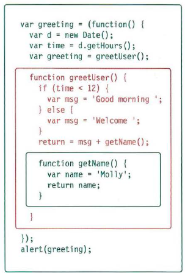
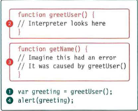
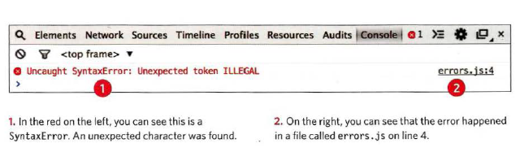
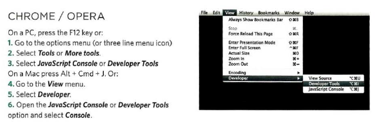
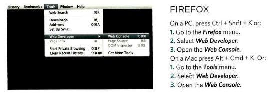
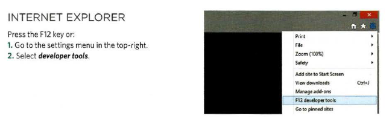
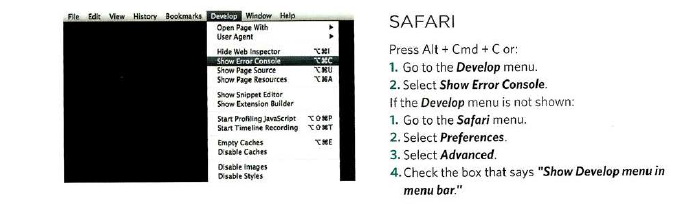
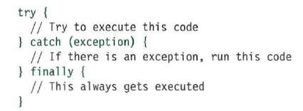

# Class 10 Reading

# JavaScript

## Chpter 10 Error Handling & Debugging
- we will learn in this chapter how we can find the errors in our code that we write.

### ORDER OF EXECUTION
- in javaScript the execution it done from top to buttom line be line if there is no function 
- if there is a function it will go and execute it and back to same order.
### EXECUTION CONTEXTS
- There is one global execution context; plus, each function creates a new
new execution context.
#### EXECUTION CONTEXT
- Every statement in a script lives in one of three
    execution contexts:
    1. GLOBAL CONTEXT
    2. FUNCTION CONTEXT
    3. EVAL CONTEXT (NOT SHOWN)

#### VARIABLE SCOPE
- The first two execution contexts correspond with the
    notion of scope
    1. GLOBAL SCOPE
    2. FUNCTION-LEVEL SCOPE

### EXECUTION CONTEXT & HOISTING
- Each time a script enters a new execution context, there are two phases
    of activity:
    1. PREPARE
        - The new scope is created
        - Variables, functions, and arguments are created
        - The value of the this keyword is determined
    2. EXECUTE
        - Now it can assign values to variables
        - Reference functions and run their code
        - Execute statements

### UNDERSTANDING SCOPE
- each execution context has its own va ri ables object.
    It holds the variables, functions, and parameters available within it.
    Each execution context can also access its parent's v a ri ables object.

    

### UNDERSTANDING ERRORS
- If a JavaScript statement generates an error, then it throws an exception.
    At that point, the interpreter stops and looks for exception-handling code.

    

### ERROR OBJECTS
- Error objects can help you find where your mistakes are and browsers have tools to help you read them.
- When an Error object is created, it will contain the following properties:

    1. **name** Type of execution
    2. **message** Description
    3. **fileNumber** Name of the JavaScript file
    4. **lineNumber** Line number of error
- There are seven types of built-in error objects in JavaScript. You'll see them on the next two pages:
    1. **Error** Generic error - the other errors
    are all based upon this error
    2. **Syntax Error** Syntax has not been followed
    3. **ReferenceError** Tried to reference a variable that is not declared/within scope 
    4. **TypeError** An unexpected data type that
    cannot be coerced
    5. **Range Error** Numbers not in acceptable range 
    6. **URI Error** encodeURI ().decodeURI(),and
    similar methods used incorrectly
    7. **EvalError** eva l () function used incorrectly

    #### Exapmple of error

    

### HOW TO DEAL WITH ERRORS
- there are two things you can do with the errors.
1. DEBUG THE SCRIPT TO FIX ERRORS
    - If you come across an error while writing a script (or when someone reports a bug), you will need to debug the code, track down the source of the error, and fix it.
2. HANDLE ERRORS GRACEFULLY
    - You can handle errors gracefully using try, catch, throw, and f i na 1 ly statements.

### BROWSER DEV TOOLS & JAVASCRIPT CONSOLE
- The JavaScript console will tell you when there is a problem with a script,
where to look for the problem, and what kind of issue it seems to be.
- there is multiple browser we can use the javaScript console in it :

    1. **Chrome** and **Opera**:

        
    2. **FireFox** :

        
    3. **Internet Explorer** :

        
    4. **Safari** :

        

### HANDLING EXCEPTIONS
- If you know your code might fail, use try, catch, and finally.Each one is given its own code block.

    

    1. **TRY** : First, you specify the code
            that you t hink might throw an
            exception within the try block.
    2. **CATCH** : If the try code block throws an
        exception, catch steps in with an
        alternative set of code.
    3. **FINALLY** : The contents of the fi na 11 y
        code block will run either
        way - whether the try block
        succeeded or failed.

# Summary
- If you understand execution contexts (which have two
stages) and stacks, you are more likely to find the error
in your code.
- Debugging is the process of finding errors. It involves a
process of deduction.
- The console helps narrow down the area in which the
error is located, so you can try to find the exact error.
- JavaScript has 7 different types of errors. Each creates
its own error object, which can tell you its line number
and gives a description of the error.
- If you know that you may get an error, you can handle
it gracefully using the try, catch, finally statements.
Use them to give your users helpful feedback.