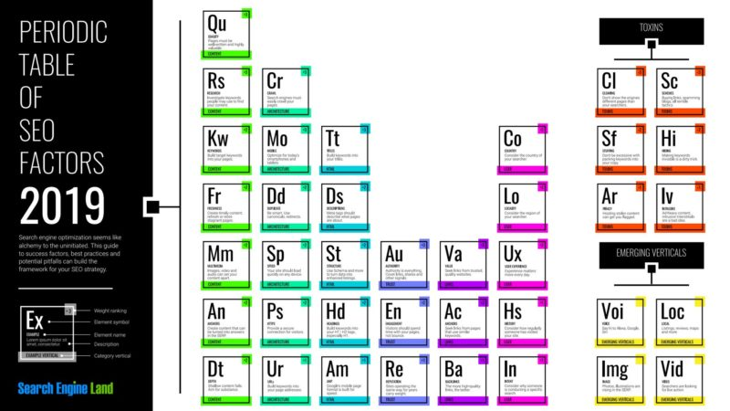

# Class 11 Reading

# Html

# Chapter 16 Images

## Controlling sizes of images in CSS
- we can change width and height for image in css by using  width and height key word.

## Aligning images Using CSS
- we can align image by using float keyword it can take two value:
    1. right
    2. left

## Background Images
- we can put image as background by using background-image properties
    - background-image

## Repeating Images
- we can repeat image in multiple way :
    1. repeat : both horizontally and vertically
    2. repeat-x :repeat horizontally
    3. repeat-y :repeat vertically
    4. no-repeat : only show image once 
    5. fixed: image stay in same position
    6. scroll: image scroll up an down

## Background Position
- we can give image spacific position 
    1. left top
    2. left center
    3. left bottom
    4. center top
    5. center center
    6. center bottom
    7. right top
    8. right center
    9. right bottom

## Contrast of background images
- it take three value 
    1. High Contrast 
    2. Low Contrast 
    3. Screen

# Summary
- You can specify the dimensions o XX f images using CSS.
This is very helpful when you use the same sized
images on several pages of your site.
- Images can be aligned both horizontally and vertically
using CSS.
- You can use a background image behind the box
created by any element on a page.
- Background images can appear just once or be
repeated across the background of the box.
- You can create image rollover effects by moving the
background position of an image.
- To reduce the number of images your browser has to
load, you can create image sprites.

# Chapter 19 Practical Information

## what is seo?
- SEO stands for “search engine optimization.” In simple terms, it means the process of improving your site to increase its visibility for relevant searches. The better visibility your pages have in search results, the more likely you are to garner attention and attract prospective and existing customers to your business.

## How does SEO work?
- Search engines such as Google and Bing use bots to crawl pages on the web, going from site to site,

## Why is SEO important for marketing?
- SEO is a fundamental part of digital marketing because people conduct trillions of searches every year, often with commercial intent to find information about products and services.

## How can I learn SEO?
- For a helpful dive into SEO, our Periodic Table Of SEO Factors will introduce you to all the key concepts you need to know, including the elements for successful on-page and off-page SEO, plus the “Toxins” or tactics that can hurt your rankings.

    

# HTML5 video and audio
- The `<video>` and `<audio>` elements allow us to embed video and audio into web pages

## The HTMLMediaElement API
- the HTMLMediaElement API provides features to allow you to control video and audio players programmatically

# Summary 
1. The time display currently breaks if the video is an hour long or more (well, it won't display hours; just minutes and seconds). Can you figure out how to change the example to make it display hours?

2. Because `<audio>` elements have the same HTMLMediaElement functionality available to them, you could easily get this player to work for an `<audio>` element too. Try doing so.