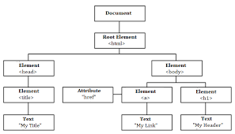

# jQuery

- jQuery is a fast, small, cross-platform and feature-rich JavaScript library.
-  light-weight and fast JavaScript library. It is cross-platform and supports different types of browsers.
- The main purpose of jQuery is to provide an easy way to use JavaScript on your website to make it more interactive and attractive. It is also used to add animation.

## jQuery Features
1. HTML manipulation
2. DOM manipulation
3. DOM element selection
4. CSS manipulation
5. Effects and Animations
6. Utilities
7. AJAX
8. HTML event methods
9. JSON Parsing
10. Extensibility through plug-ins

## summary
- my advise before learn jQuery to learn the basics of web designing before starting to learn jQuery

# Events

- jQuery events are the actions that can be detected by your web application. They are used to create dynamic web pages. An event shows the exact moment when something happens.

### Type of Events:
    1. Mouse Events
        - click
        - dblclick
        - mouseenter
        - mouseleave
    2. Keyboard Events
        - keyup
        - keydown
        - keypress
    3. Form Events
        - submit
        - change
        - blur
        - focus
    4. Document/Window Events
        - load
        - unload
        - scroll
        - resize

# The DOM

- JQuery provides methods to manipulate DOM in efficient way
-JQuery provides methods such as .attr(), .html(), and .val() which act as getters, retrieving information from DOM elements.

# 6 Reasons for Pair Programming
## How does pair programming work?
- it work with two programmer one act as driver and the other one act as navigator 

1. Greater efficiency
2. Engaged collaboration
3. Learning from fellow students
4. Social skills
5. Job interview readiness
6. Work environment readiness
