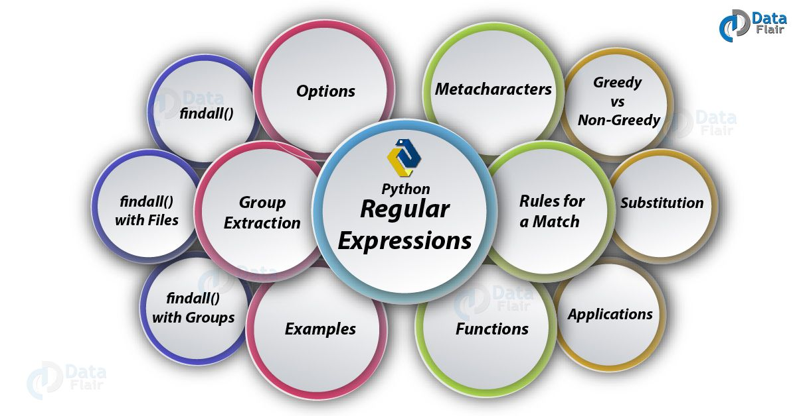
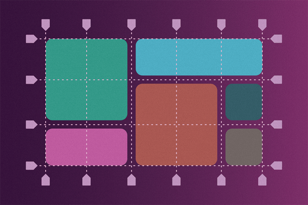

# Regex

- Regular expressions (regex or regexp) are extremely useful in extracting information from any text by searching for one or more matches of a specific search pattern (i.e. a specific sequence of ASCII or unicode characters).
- all programming languages ​​(JavaScript, Java, VB, C #, C / C++, Python, Perl, Ruby, Delphi, R, Tcl, and many others)

# CSS Grid

- CSS Grid is a powerful tool that allows for two-dimensional layouts to be created on the web. This guide was created as a resource to help you better understand and learn Grid, and was organized in a way I thought made the most sense when learning it.

### Type of Grid:
1. **Grid Container**
    - Create a grid container by setting the display property with a value of grid or inline-grid. All direct children of grid containers become grid items.
2. **Explicit Grid**
    - Explicitly set a grid by creating columns and rows with the grid-template-columns and grid-template-rows properties.

3. **Minimum and Maximum Grid Track Sizes**
    - Tracks sizes can be defined to have a minimum and/or maximum size with the minmax() function.
4. **Repeating Grid Tracks**
    - Define repeating grid tracks using the repeat() notation. This is useful for grids with items with equal sizes or many items.

# Responsive Layouts with CSS Grid

- CSS grid is now supported in Samsung internet v6.2 and many other modern browsers and has been the answer to many a prayer of web developers everywhere
- The smaller images (in a grid!) are in the perfect layout to get you started with CSS grid. Grid gives us control over how wide or narrow each of the ‘grid cells’ get.

### Type of Responsive Layout:
1. Large Image followed by articles
2. The Full Page Image Gallery
3. Card Layout
4. The Holy Grail Layout (with no set heights!)
