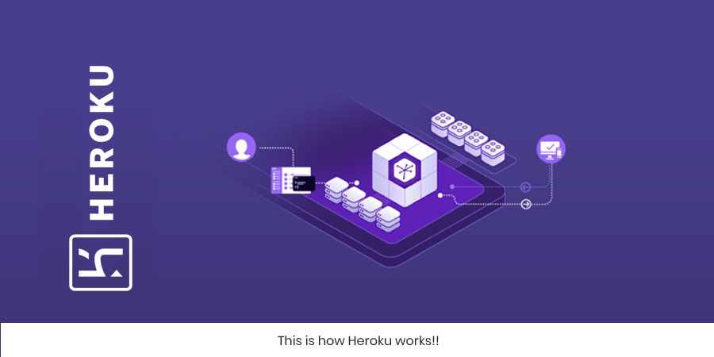

# Heroku Deployment

## Definition
- Heroku is a cloud platform as a service supporting several programming languages. One of the first cloud platforms, Heroku has been in development since June 2007, when it supported only the Ruby programming language, but now supports Java, Node.js, Scala, Clojure, Python, PHP, and Go
- we use Heroku to deploy, manage, and scale apps.
- We will start with node.js and how to deployed it with Heroku form more info [click here](https://devcenter.heroku.com/articles/getting-started-with-nodejs)

- **Why Heroku**
    - A powerful and innovative feature set:
    1. Heroku Runtime
    2. Scale
    3. Code and data rollback
    4. GitHub Integration
    5. Heroku Postgres (SQL) 
    6. Add-ons
    7. App metrics
    8. Extensibility
    9. Heroku Redis
    10. Data Clips
    11. Continuous delivery
    12. Smart containers