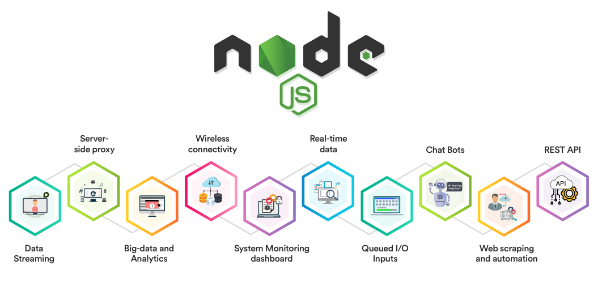
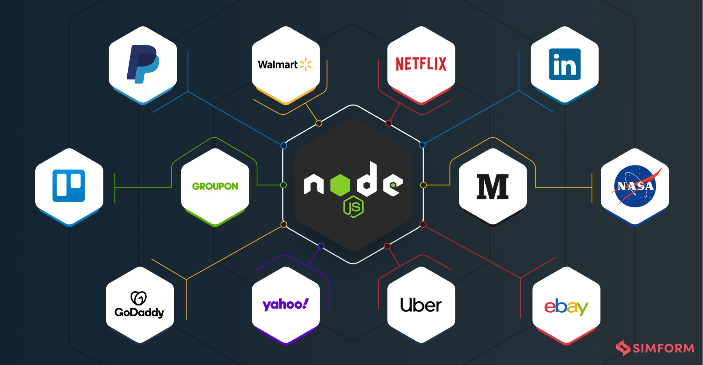
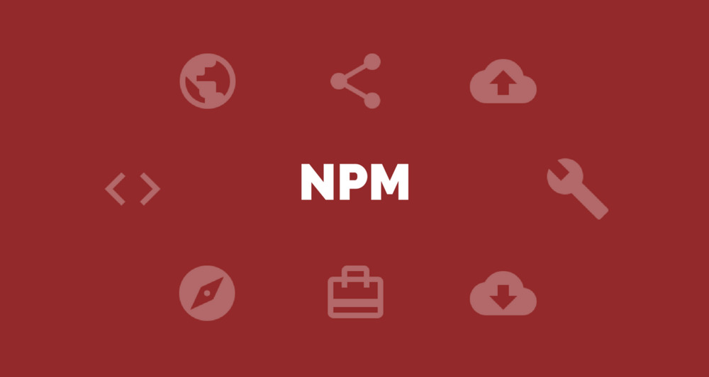

# Node, Express, and APIs

## Node.js

### Definition 
- Node.js is an open-source, cross-platform, back-end JavaScript runtime environment that runs on the Chrome V8 engine and executes JavaScript code outside a web browser.
- this is the definition of Node.js but what is **V8 engine**

- #### V8 engine Definition
    - is the open-source JavaScript engine that runs in Google Chrome and other Chromium-based web browsers, including Brave, Opera, and Vivaldi. It was designed with performance in mind and is responsible for compiling JavaScript directly to native machine code that your computer can execute.

### Companies use Node.js 

- There is many Companies use Node.js in thier software:
    1. PayPal
    2. GoDaddy
    3. NASA
    4. Yahoo
    5. NETFLEX
    6. Walmart
    7. Linkedin
    8. Uber
    9. ebay
    10. etc.....

## npm 

- npm is a package manager for the JavaScript programming language. npm, Inc. is a subsidiary of GitHub, that provides hosting for software development and version control with the usage of Git. npm is the default package manager for the JavaScript runtime environment Node.js.

## APIs 

### Definition
-An application programming interface, is a computing interface that defines interactions between multiple software intermediaries. It defines the kinds of calls or requests that can be made, how to make them, the data formats that should be used, the conventions to follow, etc.
- API is the acronym for Application Programming Interface, which is a software intermediary that allows two applications to talk to each other. Each time you use an app like Facebook, send an instant message, or check the weather on your phone, you’re using an API.

### API Also Provides Is a Layer of Security
- Your phone’s data is never fully exposed to the server, and likewise the server is never fully exposed to your phone. Instead, each communicates with small packets of data, sharing only that which is necessary—like ordering takeout. You tell the restaurant what you would like to eat, they tell you what they need in return and then, in the end, you get your meal.

### The Modern API
- Over the years, what an “API” is has often described any sort of generic connectivity interface to an application. More recently, however, the modern API has taken on some characteristics that make them extraordinarily valuable and useful:

- Modern APIs adhere to standards (typically HTTP and REST), that are developer-friendly, easily accessible and understood broadly
- They are treated more like products than code. They are designed for consumption for specific audiences (e.g., mobile developers), they are documented, and they are versioned in a way that users can have certain expectations of its maintenance and lifecycle.
- Because they are much more standardized, they have a much stronger discipline for security and governance, as well as monitored and managed for performance and scale
- As any other piece of productized software, the modern API has its own software development lifecycle (SDLC) of designing, testing, building, managing, and versioning.  Also, modern APIs are well documented for consumption and versioning.