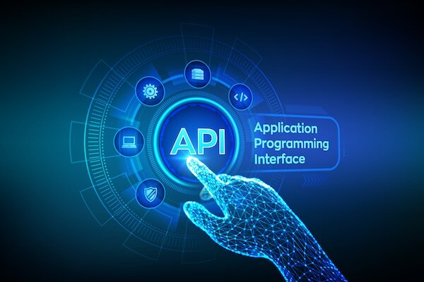

# APIs

- An API is a set of definitions and protocols for building and integrating application software.
- APIs let your product or service communicate with other products and services without having to know how they’re implemented.
- APIs are sometimes thought of as contracts, with documentation that represents an agreement between parties: If party 1 sends a remote request structured a particular way, this is how party 2’s software will respond.
- APIs simplify how developers integrate new application components into an existing architectur 

- APIs are a simplified way to connect your own infrastructure through cloud-native app development, but they also allow you to share your data with customers and other external users.
- Public APIs represent unique business value because they can simplify and expand how you connect with your partners

- APIs let you open up access to your resources while maintaining security and control.
- There are three approaches to API release policies.
    1. **Private**
        - The API is only for use internally. This gives companies the most control over their API.
    2. **Partner**
        - The API is shared with specific business partners. This can provide additional revenue streams without compromising quality.
    3. **Public**
        - The API is available to everyone. This allows third parties to develop apps that interact with your API and can be a source for innovation.
## Innovating with APIs
 - Exposing your APIs to partners or the public can:

1. Create new revenue channels or extend existing ones.
2. Expand the reach of your brand.
3. Facilitate open innovation or improved efficiency through external development and collaboration

## What’s been done to improve APIs?
- As APIs have developed into the now-ubiquitous web API, several efforts have been made to make their design a little easier and their implementation more useful.

## a lot of REST

 - APIs are RESTful as long as they comply with the 6 guiding constraints of a RESTful system:

1. **Client-server architecture:** REST architecture is composed of clients, servers, and resources, and it handles requests through HTTP.

2. **Statelessness:** No client content is stored on the server between requests. Information about the session state is, instead, held with the client.

3. **Cacheability:** Caching can eliminate the need for some client-server interactions.

4. **Layered system:** Client-server interactions can be mediated by additional layers. These layers could offer additional features like load balancing, shared caches, or security.

5. **Code on demand (optional):** Servers can extend the functionality of a client by transferring executable code.

6. **Uniform interface:** This constraint is core to the design of RESTful APIs and includes 4 facets:

    - **Resource identification in requests:** Resources are identified in requests and are separate from the representations returned to the client.

    - **Resource manipulation through representations:** Clients receive files that represent resources. These representations must have enough information to allow modification or deletion.

    - **Self-descriptive messages:** Each message returned to a client contains enough information to describe how the client should process the information.

    - **Hypermedia as the engine of application state:** After accessing a resource, the REST client should be able to discover through hyperlinks all other actions that are currently available