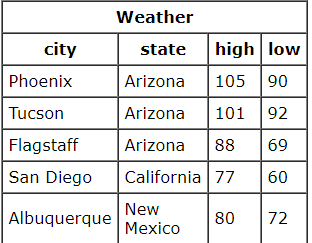
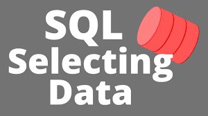
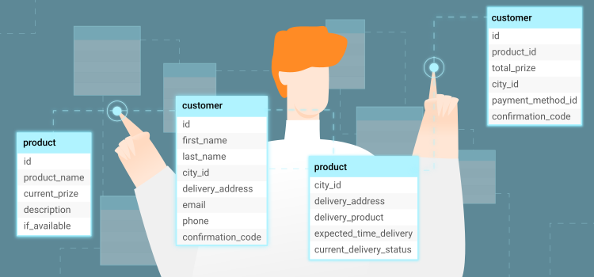
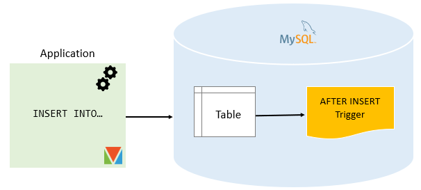
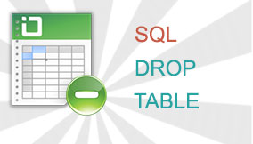

#  SQL

- stands for Structured Query Language
- SQL is a domain-specific language used in programming and designed for managing data held in a relational database management system, or for stream processing in a relational data stream management system.
- SQL is used to communicate with a database. According to ANSI (American National Standards Institute)
- it is the standard language for relational database management systems
- SQL statements are used to perform tasks such as update data on a database, or retrieve data from a database
- Some common relational database management systems that use SQL are: 
    1. Oracle
    2. Sybase
    3. Microsoft SQL Server
    4. Access
    5. Ingres
- the standard SQL commands such as "Select", "Insert", "Update", "Delete", "Create", and "Drop" can be used to accomplish almost everything that one needs to do with a database.

## Table

- A relational database system contains one or more objects called tables. The data or information for the database are stored in these tables. Tables are uniquely identified by their names and are comprised of columns and rows. Columns contain the column name, data type, and any other attributes for the column. Rows contain the records or data for the columns. Here is a sample table called "weather".

- city, state, high, and low are the columns. The rows contain the data for this table:

## Selecting Data

- The select statement is used to query the database and retrieve selected data that match the criteria that you specify. Here is the format of a simple select statement:

 - select "column1"
  [,"column2",etc] 
  from "tablename"
  [where "condition"];
  [] = optional

## Creating Tables
  
- The create table statement is used to create a new table. Here is the format of a simple create table statement:

- create table "tablename"
("column1" "data type",
 "column2" "data type",
 "column3" "data type");
Format of create table if you were to use optional constraints:

- create table "tablename"
("column1" "data type" 
         [constraint],
 "column2" "data type" 
         [constraint],
 "column3" "data type" 
        [constraint]);
 [ ] = optional

## Inserting into a Table
  
- The insert statement is used to insert or add a row of data into the table.

- To insert records into a table, enter the key words insert into followed by the table name, followed by an open parenthesis, followed by a list of column names separated by commas, followed by a closing parenthesis, followed by the keyword values, followed by the list of values enclosed in parenthesis. The values that you enter will be held in the rows and they will match up with the column names that you specify. Strings should be enclosed in single quotes, and numbers should not.

- insert into "tablename"
 (first_column,...last_column)
  values (first_value,...last_value);

## Updating Records

- The update statement is used to update or change records that match a specified criteria. This is accomplished by carefully constructing a where clause.

- update "tablename"
set "columnname" = 
    "newvalue"
 [,"nextcolumn" = 
   "newvalue2"...]
where "columnname" 
  OPERATOR "value" 
 [and|or "column" 
  OPERATOR "value"];
[] = optional

## Deleting Records

- The delete statement is used to delete records or rows from the table.

- delete from "tablename"
where "columnname" 
  OPERATOR "value" 
[and|or "column" 
  OPERATOR "value"];

[ ] = optional

## Drop a Table

- The drop table command is used to delete a table and all rows in the table.

- To delete an entire table including all of its rows, issue the drop table command followed by the tablename. drop table is different from deleting all of the records in the table. Deleting all of the records in the table leaves the table including column and constraint information. Dropping the table removes the table definition as well as all of its rows.

- drop table "tablename"
