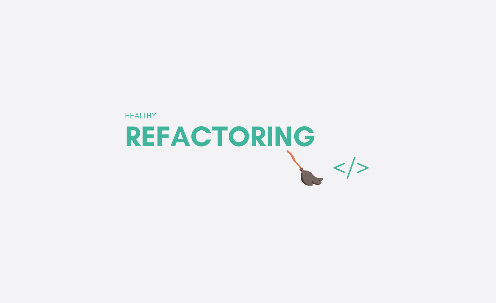
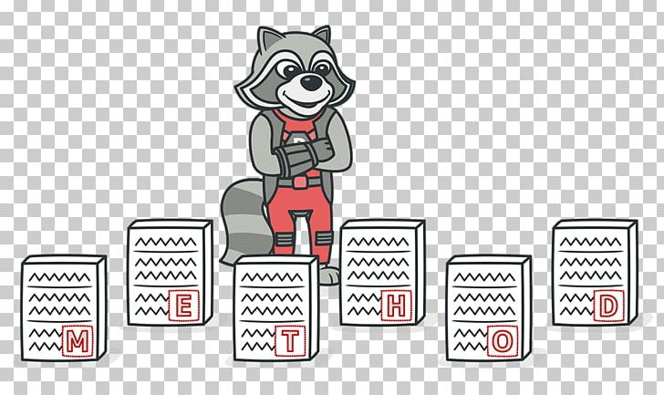

# Refactoring

- In computer programming and software design, code refactoring is the process of restructuring existing computer code—changing the factoring—without changing its external behavior. Refactoring is intended to improve the design, structure, and/or implementation of the software, while preserving its functionality. 

## Code Smells
- ### Bloaters

    - Bloaters are code, methods and classes that have increased to such gargantuan proportions that they are hard to work with. Usually these smells do not crop up right away, rather they accumulate over time as the program evolves (and especially when nobody makes an effort to eradicate them).
- ### Object-Orientation Abusers

    - All these smells are incomplete or incorrect application of object-oriented programming principles.
- ### Change Preventers

    - These smells mean that if you need to change something in one place in your code, you have to make many changes in other places too. Program development becomes much more complicated and expensive as a result.
- ### Dispensables

    - A dispensable is something pointless and unneeded whose absence would make the code cleaner, more efficient and easier to understand.
- ### Couplers

    - All the smells in this group contribute to excessive coupling between classes or show what happens if coupling is replaced by excessive delegation.

## Refactoring Techniques

- ### Composing Methods
    - Much of refactoring is devoted to correctly composing methods. In most cases, excessively long methods are the root of all evil. The vagaries of code inside these methods conceal the execution logic and make the method extremely hard to understand—and even harder to change.
- ### Moving Features between Objects
    - Even if you have distributed functionality among different classes in a less-than-perfect way, there is still hope.

    - These refactoring techniques show how to safely move functionality between classes, create new classes, and hide implementation details from public access.

- ### Organizing Data
    - These refactoring techniques help with data handling, replacing primitives with rich class functionality. Another important result is untangling of class associations, which makes classes more portable and reusable.

- ### Simplifying Conditional Expressions
    - Conditionals tend to get more and more complicated in their logic over time, and there are yet more techniques to combat this as well.

- ### Simplifying Method Calls
    - These techniques make method calls simpler and easier to understand. This, in turn, simplifies the interfaces for interaction between classes.

- ### Dealing with Generalization
    - Abstraction has its own group of refactoring techniques, primarily associated with moving functionality along the class inheritance hierarchy, creating new classes and interfaces, and replacing inheritance with delegation and vice versa.