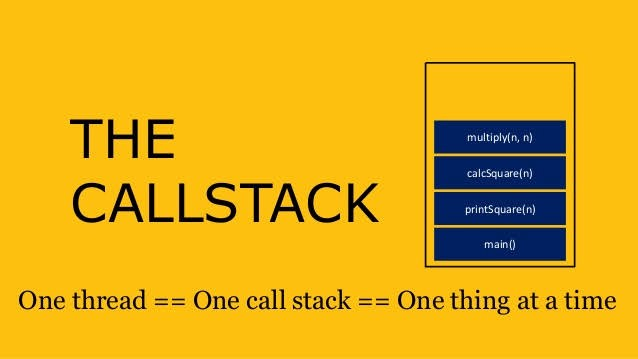

# The Call Stack and Debugging

# Call Stack

- A call stack is a mechanism for an interpreter (like the JavaScript interpreter in a web browser) to keep track of its place in a script that calls multiple functions — what function is currently being run and what functions are called from within that function, etc.
    - When a script calls a function, the interpreter adds it to the call stack and then starts carrying out the function.
    - Any functions that are called by that function are added to the call stack further up, and run where their calls are reached.
    - When the current function is finished, the interpreter takes it off the stack and resumes execution where it left off in the last code listing.
    - If the stack takes up more space than it had assigned to it, it results in a "stack overflow" error.

# Debugging
 

- The debugger statement invokes any available debugging functionality, such as setting a breakpoint. If no debugging functionality is available, this statement has no effect.

- **Debug JavaScript faster with this tips :**
1. **debugger**:
    - If you place a debugger; line in your code, Chrome will automatically stop there when executing. You can even wrap it in conditionals, so it only runs when you need it.

    `if (thisThing) { debugger;}`
    
2. **Display objects as a table**:
    - Sometimes, you have a complex set of objects that you want to view. You can either console.log them and scroll through the list, or break out the console.table helper. It makes it easier to see what you’re dealing with!

    `var animals = [`

    `{ animal: 'Horse', name: 'Henry', age: 43 },`
    `{ animal: 'Dog', name: 'Fred', age: 13 },`
   ` { animal: 'Cat', name: 'Frodo', age: 18 }]; `
   ` console.table(animals);`

3. **Try all the sizes**:
    - While having every single mobile device on your desk would be awesome, it’s not feasible in the real world. How about resizing your viewport instead? Chrome provides you with everything you need. Jump into your inspector and click the toggle device mode button. Watch your media queries come to life!

4. **Watch specific function calls and arguments**
    - In the Chrome console, you can keep an eye on specific functions. Every time the function is called, it will be logged with the values that it was passed in.