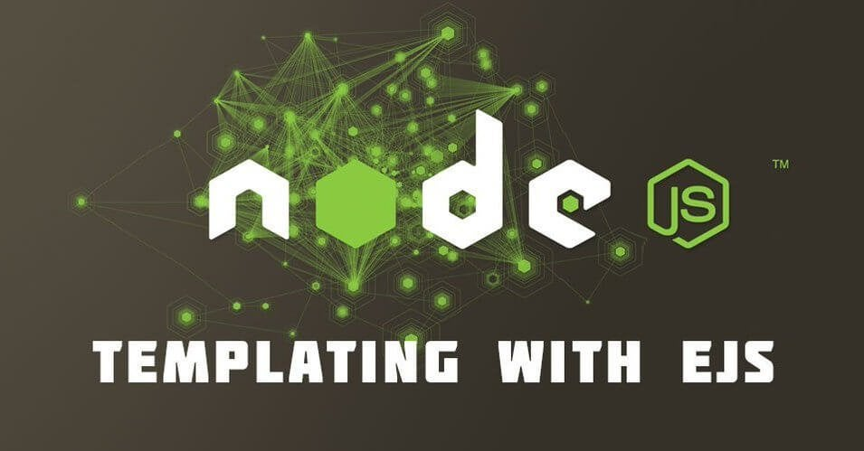

# EJS Partials

-we are going to look at EJS partials. EJS Partials help us avoid repetition of the same code on several web pages.

- For example, you may want the same header for several web pages.

- EJS partials work like EJS layouts too in creating a single fix content on a web page.

- Take Note! You should have Node.js installed in your before you can start using EJS in this article.

- To begin, ensure you have EJS and express installed via npm.
- EJS Layouts, EJS partials can work without the express-ejs-layouts module. EJS partials apply in cases like creating objects like header, footer, div.

- `var express = require('express');`

    `var ejs = require('ejs');`

    `var app = express();`

    `app.set('view engine', 'ejs');`

    `app.get("/", function(req, res) {`
   ` res.render("home");`
    `});`

    `app.get("/about", function(req, res) {`
     `  res.render("about");`
    `});`

    `app.listen(3000, function() {`
    `console.log("server is listening!!!");`
    `});`