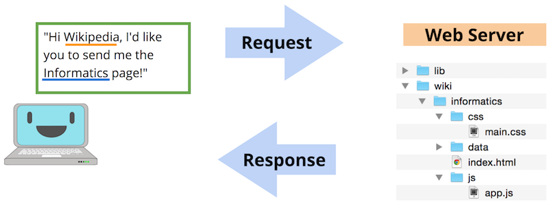
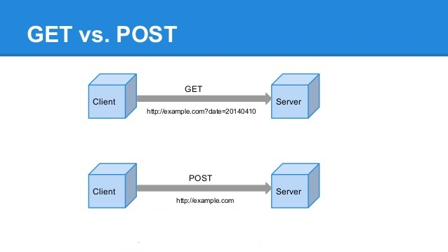
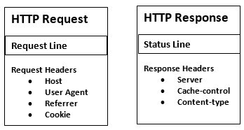

# Update/Delete

# Client/server architecture

-  a client (usually a web browser) sends a request to a server (most of the time a web server like Apache, Nginx, IIS, Tomcat, etc.), using the HTTP protocol. 
- The server answers the request using the same protocol.

- An HTML form on a web page is nothing more than a convenient user-friendly way to configure an HTTP request to send data to a server. 

## On the client side: defining how to send the data

- The `<form>` element defines how the data will be sent.
- The two most important attributes are action and method.

- The **action attribute** defines where the data gets sent. Its value must be a valid relative or absolute URL. If this attribute isn't provided, the data will be sent to the URL of the page containing the form — the current page.

- The **method attribute** defines how data is sent. The HTTP protocol provides several ways to perform a request; HTML form data can be transmitted via a number of different methods, the most common being the ***GET method*** and the ***POST method***

    

    - ### The GET method
        - The GET method is the method used by the browser to ask the server to send back a given resource: "Hey server, I want to get this resource." In this case, the browser sends an empty body. Because the body is empty, if a form is sent using this method the data sent to the server is appended to the URL.
    - ### The POST method
        - The POST method is a little different. It's the method the browser uses to talk to the server when asking for a response that takes into account the data provided in the body of the HTTP request: "Hey server, take a look at this data and send me back an appropriate result." If a form is sent using this method, the data is appended to the body of the HTTP request.
    
## Viewing HTTP requests

 - HTTP requests are never displayed to the user (if you want to see them, you need to use tools such as the Firefox Network Monitor or the Chrome Developer Tools). As an example, your form data will be shown as follows in the Chrome Network tab. 

 # On the server side: retrieving the data

 -  the server receives a string that will be parsed in order to get the data as a list of key/value pairs. The way you access this list depends on the development platform you use and on any specific frameworks you may be using with it.

 # A special case: sending files

 

 - Sending files with HTML forms is a special case. Files are binary data — or considered as such — whereas all other data is text data. Because HTTP is a text protocol, there are special requirements for handling binary data.

 ### The enctype attribute
- This attribute lets you specify the value of the Content-Type HTTP header included in the request generated when the form is submitted. This header is very important because it tells the server what kind of data is being sent. By default, its value is application/x-www-form-urlencoded. In human terms, this means: "This is form data that has been encoded into URL parameters."

- If you want to send files, you need to take three extra steps:

- Set the method attribute to POST because file content can't be put inside URL parameters.
- Set the value of enctype to multipart/form-data because the data will be split into multiple parts, one for each file plus one for the text data included in the form body (if text is also entered into the form).
- Include one or more `<input type="file">` controls to allow your users to select the file(s) that will be uploaded.

