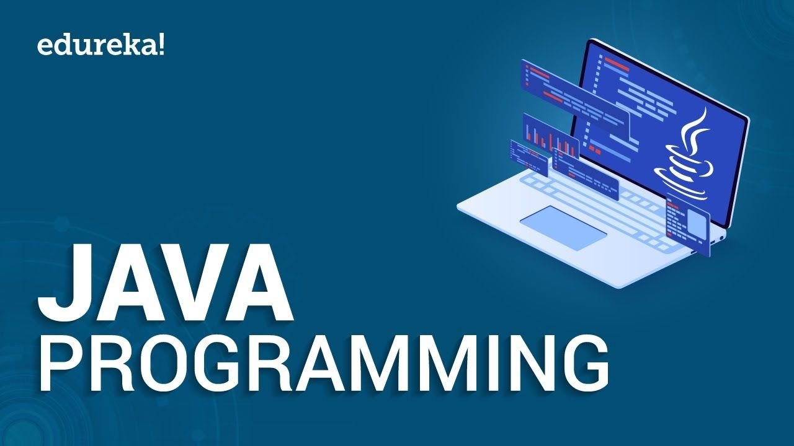

#  Java Language Basics

# Java Basics

## Variables 
- There is four type of variable
    1. **Instance Variables (Non-Static Fields)** : objects store their individual states in «non-static fields», that is, fields declared without the static keyword.
    2. **Class Variables (Static Fields)** : A class variable is any field declared with the static modifier; this tells the compiler that there is exactly one copy of this variable in existence, regardless of how many times the class has been instantiated. A field defining the number of gears for a particular kind of bicycle could be marked as static since conceptually the same number of gears will apply to all instances. The code static int numGears = 6; would create such a static field.
    3. **Local Variables** : Similar to how an object stores its state in fields, a method will often store its temporary state in local variables. The syntax for declaring a local variable is similar to declaring a field (for example, int count = 0;).
    4. **Parameters** : The important thing to remember is that parameters are always classified as "variables" not "fields". This applies to other parameter-accepting constructs as well (such as constructors and exception handlers) that you'll learn about later in the tutorial.

## Operators
- Operators are special symbols that perform specific operations on one, two, or three operands, and then return a result

| Operators |Precedence |
|-----------|-----------|
|postfix	|expr++ expr--|
|unary	|++expr --expr +expr -expr ~ !|
|multiplicative|	* / %|
|additive|	+ -|
|shift|	<< >> >>>|
|relational|	< > <= >= instanceof|
|equality|	== !=|
|bitwise| AND	&|
|bitwise| exclusive OR	^|
|bitwise| inclusive OR	||
|logical| AND	&&|
|logical| OR	|||
|ternary|	? :|
|assignment|	= += -= *= /= %= &= ^= |= <<= >>= >>>=|

## Expressions, Statements, and Blocks

### Expressions
- An expression is a construct made up of variables, operators, and method invocations, which are constructed according to the syntax of the language, that evaluates to a single value. You've already seen examples of expressions

### Statements
- Statements are roughly equivalent to sentences in natural languages. A statement forms a complete unit of execution. The following types of expressions can be made into a statement by terminating the expression with a semicolon ;).

### Blocks
- A block is a group of zero or more statements between balanced braces and can be used anywhere a single statement is allowed

## Control Flow Statements
- The statements inside your source files are generally executed from top to bottom, in the order that they appear. Control flow statements, however, break up the flow of execution by employing decision making, looping, and branching, enabling your program to conditionally execute particular blocks of code. This section describes the decision-making statements (if-then, if-then-else, switch), the looping statements (for, while, do-while), and the branching statements (break, continue, return) supported by the Java programming language.

# Reddit thread on compiling
- As you may know, everything in a computer is represented by a series of 1's and 0's . When the computer runs a program, the program itself is made of a bunch of 1's and 0's. So we made higher level languages like Java and C# to write code in. These languages look a lot more like English, so they're a lot easier to write and maintain.

- When you compile code, the compilor takes the program the human wrote, and converts it into the program the computer can understand . A very common mistake is to forget that semicolon, so when you try and compile the compilor gives you an error.